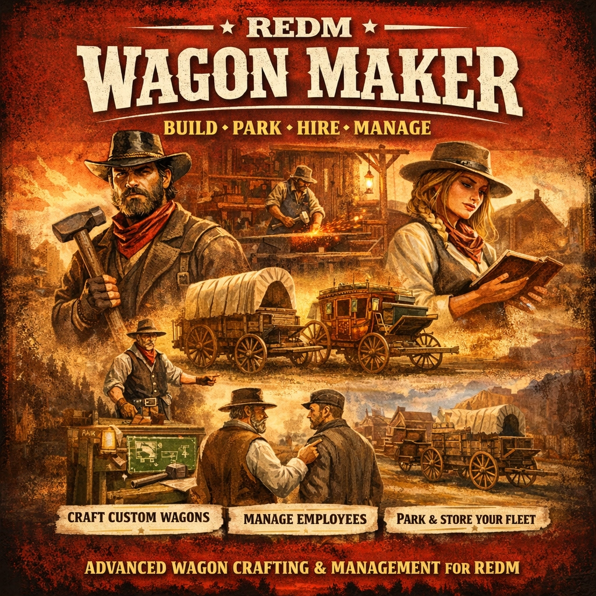

# 🐴 RSG Wagon Maker
**Advanced Wagon Crafting, Parking, and Employee Management System for RedM (RSGCore)**



`rsg-wagonmaker` is a premium, feature-rich resource that empowers players to own and operate their own Wagon Making business. It moves beyond simple "click-to-buy" mechanics by introducing a deep crafting system, interactive 3D previews, persistent parking with "Ghost Wagon" protection, and a complete employee management suite.

---

## ✨ Key Features

### 🛠️ Professional Crafting System
- **Immersive UI**: Vintage-styled crafting menu with dynamic recipe lists and material requirements.
- **Interactive 3D Preview**: Before crafting, effectively "test drive" the look of the wagon.
    - **Visual Customization**: Change **Tints** and **Liveries** in real-time.
    - **Rotation**: Use **Q / E** keys to rotate the wagon and inspect it from all angles.
    - **Networked**: Other players can see what you are previewing!
- **Material Economy**: Wagons require wood, iron, leather, and other resources, driving the server's economy.

### 🅿️ Advanced Parking & Insurance
- **Persistent Storage**: Valid wagons are saved to the database and survive server restarts.
- **Ghost Wagon Protection**: Use the **"Force Return (Insurance)"** button in the parking menu to retrieve wagons that have fallen under the map, been destroyed, or lost to OneSync issues. No admin intervention required!
- **Stash Integration**: Every crafted wagon comes with its own unique stash (`rsg-inventory` / `ox_inventory`), accessible via Third Eye.

### 💼 Employee Management (Boss Menu)
- **In-Game Hiring**: Bosses can hire nearby players directly through the "Job Management" UI.
- **Roster Management**: View all employees, their grades, and stats.
- **Promote/Fire**: Manage your workforce with simple UI clicks.
- **Location-Based Jobs**: Supports specific jobs per town (e.g., `wagon_valentine` vs `wagon_blackwater`).

### 🌍 NPC-Based Zones
- We have moved away from invisible markers. All interactions are handled via **NPCs** using `ox_target`.
    - **Crafting NPC**: The master craftsman who handles orders and previews.
    - **Stable Master NPC**: The yard manager who handles parking and storage.

---

## 📍 Locations & Jobs

The resource is pre-configured with **7 Wagon Workshops**, each with distinct job requirements:

| Location | Job Name | Zone Type |
|----------|----------|-----------|
| **Valentine** | `wagon_valentine` | NPC |
| **Rhodes** | `wagon_rhodes` | NPC |
| **Saint Denis** | `wagon_saint` | NPC |
| **Blackwater** | `wagon_blackwater` | NPC |
| **Strawberry** | `wagon_strawberry` | NPC |
| **Armadillo** | `wagon_armadillo` | NPC |
| **Tumbleweed** | `wagon_tumbleweed` | NPC |

> **Note:** You can easily add more locations in `config.lua` by simply adding new NPC entries.

---

## 📦 Installation

1.  **Dependencies**:
    -   `rsg-core`
    -   `ox_lib`
    -   `ox_target` (Required for interaction)
    -   `ox_inventory` OR `rsg-inventory`

2.  **Database Setup**:
    -   Import the provided SQL file `sql/wagonmaker.sql`.
    -   It creates two tables:
        -   `wagonmaker_wagons`: Stores player wagons, customization, and stash ID.
        -   `wagon_maker_employees`: Stores job-specific employee data.

3.  **Config**:
    -   Check `config.lua` to adjust prices, crafting times, or add new wagon models.

4.  **Start**:
    -   Add `ensure rsg-wagonmaker` to your `server.cfg`.

---

## ⚙️ Configuration Guide

### 1. Adding Wagons (`Config.Wagons`)
Add new recipes easily. The script handles the logic.

```lua
['cart01'] = {
    label = "Light Peasant Cart",
    description = "A simple cart for light transport.",
    category = "carts",
    craftTime = 30000, -- 30 seconds
    materials = {
        { item = "wood_log", amount = 8 },
        { item = "iron_parts", amount = 4 },
    },
    model = "cart01", -- The actual spawn code
    maxWeight = 150000, -- 150kg Stash
    slots = 60,
    -- Customization Options (if supported by model)
    customizations = {
        livery = { 0, 1, 2 },
        tint = { 0, 1, 3 }
    }
}
```

### 2. Setting Up Zones (`Config.CraftingNPCs` & `Config.ParkingNPCs`)
Instead of coordinates for markers, you now define **NPCs**.

```lua
Config.CraftingNPCs = {
    {
        model = "s_m_m_valdealer_01", -- The Ped Model
        coords = vector4(-242.42, 696.51, 113.46, 226.5), -- Location
        previewPoint = vector4(-238.21, 701.32, 113.52, 90.0), -- Where the preview wagon appears
        requiredJob = "wagon_valentine" -- Job restriction
    }
}
```

### 3. Tuning
-   **`Config.UseOxTarget = true`**: Keep this enabled for best performance and interaction.
-   **`Config.Keybindings`**: If target is disabled, configure fallback keys here.

---

## 🎮 Player Guide

### How to Craft & Preview
1.  Approach the **Crafting NPC** (usually inside the workshop).
2.  **Alt-Click (Third Eye)** and select **"Craft Wagon"**.
3.  Choose a wagon model.
4.  **Preview It**:
    -   Use **Q / E** to rotate the wagon.
    -   Use the menu to try different **Liveries** and **Colors**.
5.  **Craft**: Be sure you have the materials!
    -   Once crafted, the wagon is sent to the **Stable Master**.

### How to Park & Retrieve
1.  Go to the **Stable Master NPC** (usually outside at the hitching post).
2.  **Alt-Click** and select **"Access Wagon Yard"**.
3.  **Spawn**: Click your wagon to bring it out.
4.  **Store**: Drive near the NPC and select "Store Wagon" via Third Eye or the menu.
5.  **Lost Wagon?**: If your wagon is destroyed or lost, open the menu and click **"Force Return (Insurance)"** to reclaim it instantly.

### Employee Management (Bosses)
1.  Open the **Crafting Menu**.
2.  Click the **"Job Management"** tab.
3.  **Hire**: Select a nearby player to employ them.
4.  **Manage**: Promote, Demote, or Fire off-duty employees from the roster.

---

## 🛠️ Developer Exports

**Server Side:**
- `exports['rsg-wagonmaker']:GetPlayerWagonCount(source)`
- `exports['rsg-wagonmaker']:GetPlayerWagons(source)`
- `exports['rsg-wagonmaker']:GetWagonById(wagonId)`

**Client Side:**
- `exports['rsg-wagonmaker']:IsInPreviewZone()`
- `exports['rsg-wagonmaker']:GetPreviewWagon()`

---
*Created for the RedM Community.*


